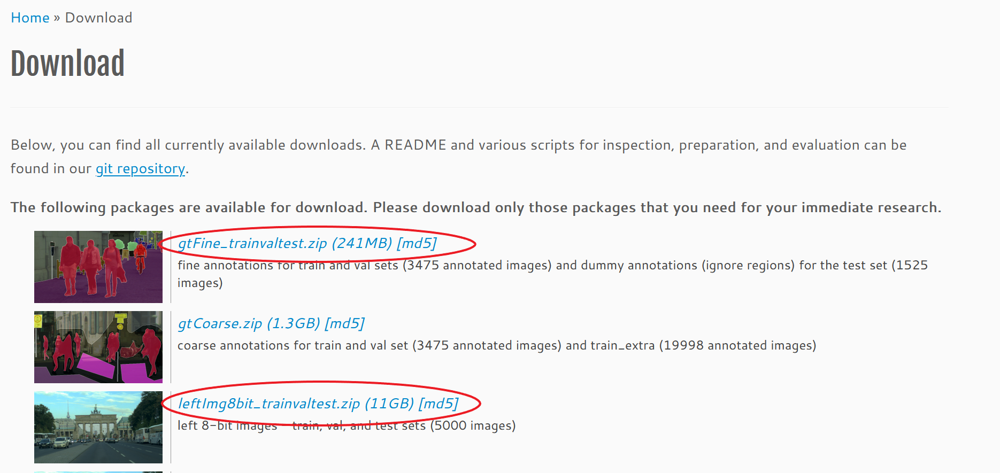
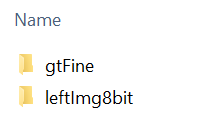

# Cityscapes

## Step 1: Create an Account or Log in at cityscapes-dataset.com

Go to "https://www.cityscapes-dataset.com". Click on "Downloads" at the top right of the page. If you do not already have an account, create one by clicking on "Register". Now fill in the necessary informations. 

## Step 2: Download the Dataset

If you are logged in, go to the download page at https://www.cityscapes-dataset.com/downloads/ and download "gtFine_trainvaltest.zip" and "leftImg8bit_trainvaltest.zip".

## Step 3: Specify the Base Directory and Extract the Downloaded Files
First, ensure that you've specified your base directory in your `config.ini` file. For example:

    BASE_DIR = C:/IM/Cityscapes/

Inside the base directory you've specified, create a folder named `original_data`. Using the example above, this would be:

    C:/IM/Cityscapes/original_data/

Once the files are downloaded, extract the data into the `original_data` folder. This can be done using built-in OS tools or third-party tools like 7-Zip or WinRAR.

After extracting the files, the contents of the `original_data` folder should look like this:

## Step 4: Create the Datasets and Start Training

Next, execute all Python scripts in the provided order to reproduce all results. 

For those who wish to test specific approaches, you must at least generate the training data using the scripts 
`00_Cityscapes_resize_images_and_masks.py` and `01_Cityscapes_split_original_train_val.py`, and train the subset models using `03_Cityscapes_subset.py` or `04_Cityscapes_subset_aug.py`.

## Reference
 
[1] M. Cordts, M. Omran, S. Ramos, T. Rehfeld, M. Enzweiler, R. Benenson, U. Franke, S. Roth, and B. Schiele, “The Cityscapes Dataset for Semantic Urban Scene Understanding,” in Proc. of the IEEE Conference on Computer Vision and Pattern Recognition (CVPR), 2016.

[2] M. Cordts, M. Omran, S. Ramos, T. Scharwächter, M. Enzweiler, R. Benenson, U. Franke, S. Roth, and B. Schiele, “The Cityscapes Dataset,” in CVPR Workshop on The Future of Datasets in Vision, 2015.
