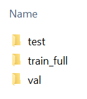

# HeLa

## Step 1: Download the Dataset

Go to https://drive.google.com/file/d/1JRlgYDcxYdWUhCbLHrTVO8UizLhTnF1W/view and download the ZIP-file.

## Step 2: Specify the Base Directory and Extract the Downloaded Files
First, ensure that you've specified your base directory in your `config.ini` file. For example:

    BASE_DIR = C:/IM/HeLa/

Once the files are downloaded, extract the data into this base directory. This can be done using built-in OS tools or third-party tools like 7-Zip or WinRAR.

After extracting the files, the contents of the `original_data` folder should look like this:

## Step 3: Create the Datasets and Start Training

Next, execute all Python scripts in the provided order to reproduce all results. 

For those who wish to test specific approaches, you must at least generate the training data using the scripts 
`00_HeLa_create_crops.py` and `01_HeLa_split_train_in_labeled_and_unlabeled.py`, and train the subset models using `03_HeLa_subset.py` or `04_HeLa_subset_aug.py`.

## Licence
This dataset is licensed under the Open Data Commons Attribution (ODC-BY) license. Please cite https://arxiv.org/abs/2401.14387 when using this dataset

## Funding
The creation of the HeLa Dataset was funded by the Deutsche Forschungsgesellschaft (DFG, German Research foundation), SFB1403 – project no. 414786233 and SPP2306 – project no. GA1641/7-1 and by the Bundesministerium für Bildung und Forschung (BMBF) project. 16LW0213. 

