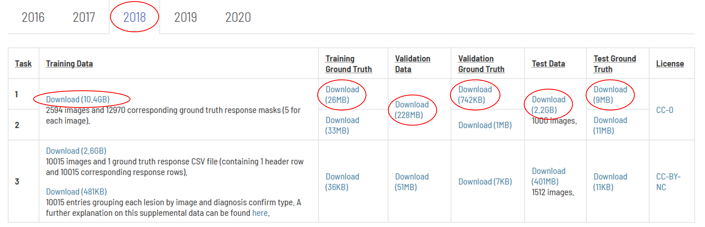
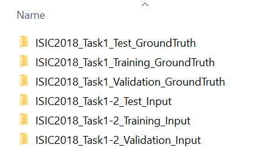

# ISIC 2018

## Step 1: Create an Account or Log in at the ISIC Archive

Navigate to "https://challenge.isic-archive.com" in your web browser. If you do not already have an account, click on "Create Account" at the top right of the page and fill in the necessary information. Verify your account via email. 

## Step 2: Download the Dataset

Now, go to the ISIC 2018 dataset page at https://challenge.isic-archive.com/data/#2018 and download all ZIP-files for Task 1.

## Step 3: Specify the Base Directory and Extract the Downloaded Files
First, ensure that you've specified your base directory in your `config.ini` file. For example:

    BASE_DIR = C:/IM/ISIC_2018/

Inside the base directory you've specified, create a folder named `original_data`. Using the example above, this would be:

    C:/IM/ISIC_2018/original_data/

Once the files are downloaded, extract the data into the `original_data` folder. This can be done using built-in OS tools or third-party tools like 7-Zip or WinRAR.

After extracting the files, the contents of the `original_data` folder should look like this:

## Step 4: Create the Datasets and Start Training

Next, execute all Python scripts in the provided order to reproduce all results. 

For those who wish to test specific approaches, you must at least generate the training data using the scripts 
`00_ISIC_2018_preprocess_images.py` and `01_ISIC_2018_split_original_train.py`, and train the subset models using `03_ISIC_2018_subset.py` or `04_ISIC_2018_subset_aug.py`.

## Reference
 
[1] Noel Codella, Veronica Rotemberg, Philipp Tschandl, M. Emre Celebi, Stephen Dusza, David Gutman, Brian Helba, Aadi Kalloo, Konstantinos Liopyris, Michael Marchetti, Harald Kittler, Allan Halpern: "Skin Lesion Analysis Toward Melanoma Detection 2018: A Challenge Hosted by the International Skin Imaging Collaboration (ISIC)", 2018; https://arxiv.org/abs/1902.03368

[2] Tschandl, P., Rosendahl, C. & Kittler, H. The HAM10000 dataset, a large collection of multi-source dermatoscopic images of common pigmented skin lesions. Sci. Data 5, 180161 doi:10.1038/sdata.2018.161 (2018).
