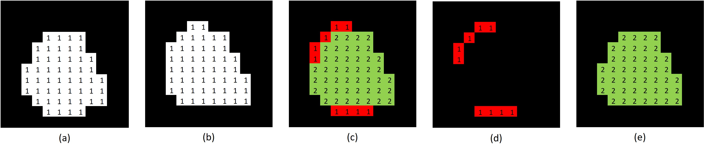
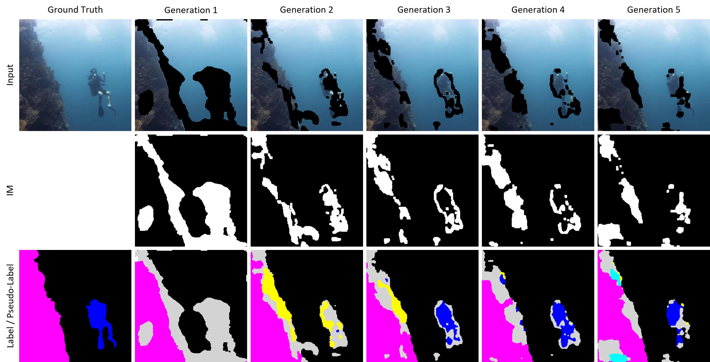
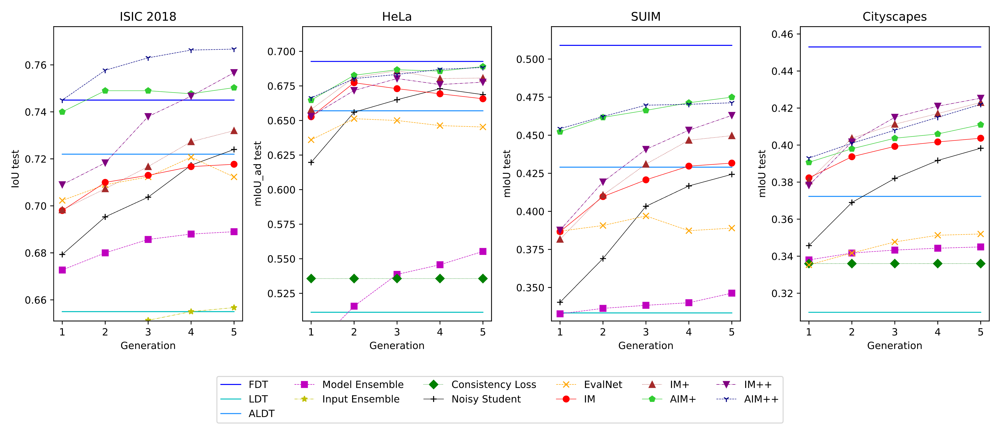
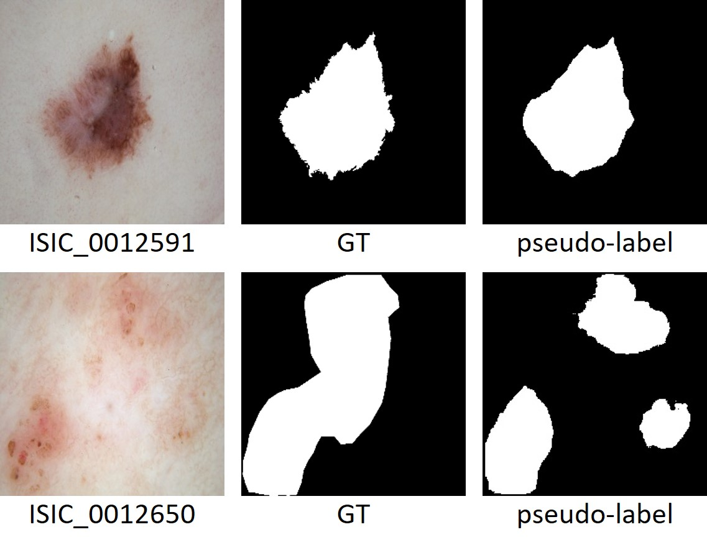

# Inconsistency Masks

Generating sufficient labeled data is a significant hurdle in the efficient execution of deep learning projects, especially in uncharted territories of image segmentation where labeling demands extensive time, unlike classification tasks. Our study confronts this challenge, operating in an environment constrained by limited hardware resources and the lack of extensive datasets or pre-trained models. We introduce the novel use of Inconsistency Masks (IM) to effectively filter uncertainty in image-pseudo-label pairs, substantially elevating segmentation quality beyond traditional semi-supervised learning techniques. By integrating IM with other methods, we demonstrate remarkable binary segmentation performance on the ISIC 2018 dataset, starting with just 10% labeled data. Notably, three of our hybrid models outperform those trained on the fully labeled dataset. Our approach consistently achieves exceptional results across three additional datasets and shows further improvement when combined with other techniques. For comprehensive and robust evaluation, this paper includes an extensive analysis of prevalent semi-supervised learning strategies, all trained under identical starting conditions. 

	

## Creation of an Inconsistency Masks

Creation of an Inconsistency Masks with two models: (a) & (b) binary prediction of model 1 and 2 after threshold, (c) sum of the two prediction masks (d) Inconsistency  Mask (e) final prediction mask

## Inconsistency Masks usage

IM is used to remove the uncertainty from the pseudo-label as well as from the input image. Here you can see the changes in an input image and the corresponding pseudo-label on the SUIM dataset for IM+ over all five Generations. Magenta represents reefs, black indicates background or waterbody, gray represents IM, blue for divers, yellow for fish, and turquoise for wrecks.

## Results

Due to limited hardware resources and the scale of our study, which required training thousands of U-Nets, we could only use small datasets and train tiny U-Nets (0.17 - 2.72 million parameters) compared to modern ViTs. But the uniform training conditions across all approaches ensure that our findings are still comparable.

In this diagram, we focus on results that exceed those of Labeled Dataset Training (LDT) to avoid excessively compressing the representation of other outcomes. For a complete overview, a diagram with all results will be available in the appendix of the paper. The benchmarks used include Full Dataset Training (FDT), Labeled Dataset Training (LDT, randomly selected 10% of the complete dataset), and Augmented Labeled Dataset Training (ALDT, Labeled Dataset with 9 additional augmented versions of each image). The SSL approaches should surpass ALDT to justify their added complexity.
Among common SSL approaches – Model Ensemble, Input Ensemble, Consistency Loss, and Noisy Student – all but Noisy Student proved to be of limited effectiveness.

**EvalNet:** This approach, inspired by the ValueNet from the AlphaGo paper, to our knowledge, has not yet been used for image segmentation. EvalNet assesses the segmentation quality of pseudo-labels, using only those segmentation masks for training that exceed a set threshold in IoU/mIoU score.

**IM:** Our novel approach demonstrates strong performance, consistently outperforming all other SSL methods across various datasets, particularly in the initial generations. The only exception is the Noisy Student method, which manages to match or surpass IM after four Generations in ISIC 2018, albeit with approximately six times more parameters.

**Combination Approaches:** IM+ combines IM with Noisy Student. In AIM+, the starting point is the best model from ALDT, not LDT, and the Labeled Dataset is replaced by the Augmented Labeled Dataset. In IM++ and AIM++, EvalNet is also integrated.

## How is it possible that IM++, AIM+ and AIM++ perform better then FDT? 

IM++ beats Full Dataset Training on ISIC 2018 by efficiently balances detailed and coarse annotations in its pseudo-label masks (right column) compared to the Ground Truth (GT) masks (middle column).

## Acknowledgement
I would like to extend my heartfelt gratitude to the Deep Learning and Open Source Community, particularly to Dr. Sreenivas Bhattiprolu (https://www.youtube.com/@DigitalSreeni), Sentdex (https://youtube.com/@sentdex) and Deeplizard (https://www.youtube.com/@deeplizard),  whose tutorials and shared wisdom have been a big part of my self-education in computer science and deep learning. This work would not exist without these open and free resources.  

## Paper
https://arxiv.org/abs/2401.14387

